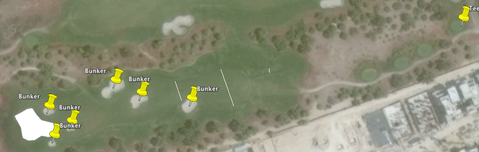

Overview
--------

The `golfcoursegeo` package converts map layers created in Keyhole Markup Language (KML), usually via Google Earth, into
information about the structure of a golf course.  Typically, this information is then used in analytical studies of golf
performance for golfers playing the documented courses.

Installation
------------

This package is not currently available on CRAN.  Install directly from github:

``` r
# install.packages("devtools")
devtools::install_github("scottcame/golfcoursegeo")
```

Preparing a KML File
--------------------

There is a [sample KML file](sample-kml/Jumeirah%20Golf%20Estates.kml) included in the distribution, for the Jumeriah Golf
Estates course in Dubai, venue for the European
Tour Championship tournament each year. It will probably be most helpful for you to open this KML file in Google Earth and just
start exploring.  A typical hole is illustrated here.

*Hole 1*



When first identifying a hole in Google Earth, first find where the tee box is.  Typically, for professional tournaments, the
"back tees" are used, so choose the tee box farthest from the green.

The key aspects to define for a Par 4 or 5 are:

* A path across the fairway at 200, 250, and 300 yards.  Use the ruler tool in Google Earth to find where these points are.
Name these paths "200 width", "250 width", and "300 width".
* A placemark named "Tee" at the tee.
* A placemark named "Bunker" at each bunker, and one named "Hazard" at each water hazard.  If a hazard or bunker is large enough
to be reachable from the tee at 200 and 250 yards, then place two placemarks (same for 250 and 300 yards).  For greenside
hazards, add a placemark for each 90 degrees of the green's perimeter bordered by the hazard.  So, an island green in the middle
of a lake would have four hazard placemarks.
* A polygon around the circumference of the green

For Par 3 holes, follow the same process, except do not place the 200, 250, and 300 yard width lines (since par 3 holes do not
have a fairway).

Place the placemarks, lines, and polygons for each hole in a folder named "Hole X", where X is 1..18.

R Usage
-------

There are two functions exposed by the package:

* `extractHoleInfoFromKmlLayer`: generates a one-row tibble containing the data for a single hole (which is represented by
a layer, or folder, in the KML file)
* `extractCourseInfoFromKmlFiles`: generates an eighteen-row tibble, containing the data for an entire course (one KML file)

*Elevation Information*

The functions call out to the Google Elevation API to get mean sea level elevation for the tee, green, and the three fairway yardage
line midpoints.  For large projects, you may find it desirable to cache the elevation information; you can do this by passing
a parameter to either function.